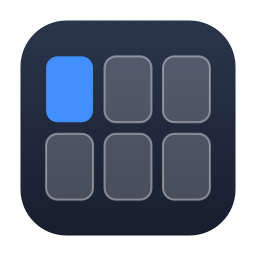
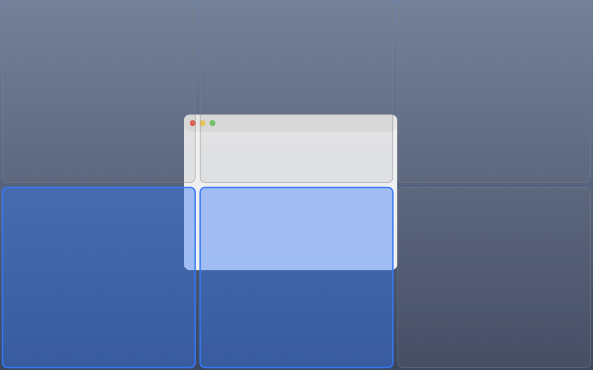
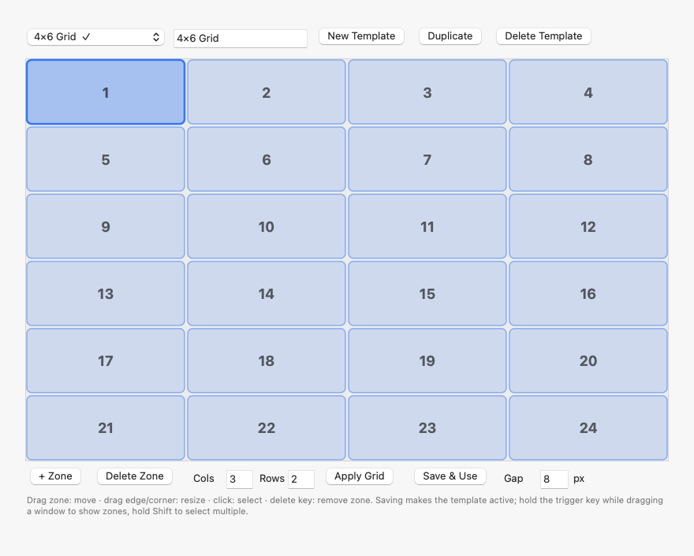
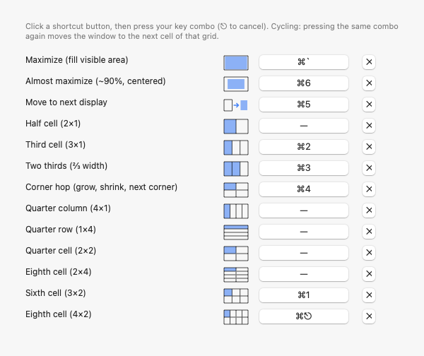
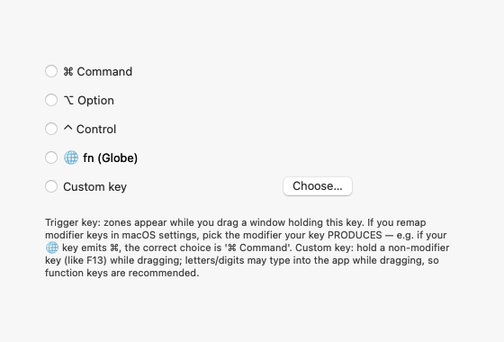

<p align="center">
  
</p>

<h1 align="center">RectZones</h1>

<p align="center">
  <b>FancyZones-style window management for macOS.</b><br/>
  Design your own screen zones, drop windows into them, drive everything from the keyboard.
</p>

<p align="center">
  
</p>

## What it does

- **Drag & snap** — hold the trigger key (⌘ by default) while dragging a window: your zone
  template appears on screen; drop the window on a zone and it snaps in.
- **Sweep to combine** — same key, no second modifier: keep it held and sweep over several
  zones and the window fills their combined area. The preview lights up exactly what you'll
  get, before you drop. Swept too far? Let go of the key to cancel, press it again and
  re-sweep.
- **Edge & corner snapping** — no key needed: push a window to a corner for a quarter,
  the top edge to maximize, the bottom edge for thirds (slide along for two-thirds),
  the sides for halves.
- **Keyboard cycling** — press the same shortcut again and the window hops to the next
  cell: grids from 2×1 to 4×2, two-thirds, a grow-and-hop corner ladder, move to next
  display. Every shortcut row shows a tiny preview of what it covers.
- **Template editor** — draw zones freely or type columns × rows and hit Apply Grid.
  Name it, save it, switch templates with one click.
- **Rotated displays get their own template** — a layout drawn for a wide screen is
  geometrically valid on a portrait monitor and completely useless there. Save a second
  template as *Portrait only* and each display uses the one that fits its shape.
- **Adjustable gap** between placed windows (0–40 px), multi-monitor aware,
  Objective-C with zero dependencies.

## Screenshots

| Template editor | Shortcuts | Trigger key |
|---|---|---|
|  |  |  |

## Install — the easy way 🤖

Using an AI coding agent (Claude Code or similar)? Point it at this repo and say
**"install this"**. It follows [SETUP.md](SETUP.md): builds the app, walks you
through the single Accessibility permission, verifies everything against the diagnostic
log, and gives you a quick tour.

## Install — by hand

```bash
git clone https://github.com/RectZones/RectZones.git rectzones
cd rectzones
./build.sh
open build/RectZones.app
```

When macOS asks, grant Accessibility (System Settings → Privacy & Security →
Accessibility → RectZones **on**). The menu bar icon flips from **▦⚠** to **▦** when
you're ready. That's the whole install — no account, no notarization, nothing else.

**Requirements:** macOS 13+, Xcode Command Line Tools (`xcode-select --install`).

## Troubleshooting

<details>
<summary>Click to expand the known pitfalls (all field-tested)</summary>

1. **Rebuilding breaks the permission — and the switch still looks ON.** The app is
   ad-hoc signed, so every build gets a new identity while the existing Accessibility
   entry keeps authorizing the previous one. The row reads **ON**, the menu bar icon
   reads **▦⚠**, and the log says `trusted=0`. Toggling the row off and on does NOT fix
   it. Remove and re-add it: System Settings → Privacy & Security → Accessibility →
   select **RectZones** → **−**, then **+** and pick your `build/RectZones.app`
   (⌘⇧G pastes a path). Reopen the app; the log should show `event tap installed`.
   Careful not to grab the neighbouring **Rectangle** row if you have that installed.
   (`tccutil reset Accessibility app.rectzones.RectZones` is an alternative, but the
   remove-and-re-add is what reliably works.)
2. **macOS built-in tiling gets in the way** (macOS 15+). Its edge-drag overlay looks
   like ours but ignores templates. Disable:
   `defaults write com.apple.WindowManager EnableTilingByEdgeDrag -bool false && killall WindowManager`
3. **Other window managers** (Rectangle, BetterSnapTool…) draw their own overlays on
   drag. Quit them or disable their snapping while using RectZones.
4. **Remapped modifier keys.** Pick the modifier your key *produces*, not the key label —
   e.g. if your 🌐 key is remapped to ⌘, the correct trigger is "⌘ Command".
5. **Shortcut conflicts.** If another app holds the same global combo, ours silently
   can't register — assign a different one in Settings → Shortcuts.

Diagnostic log: `/tmp/rectzones.log` (permission state, trigger detection, every
placement). Config: `~/Library/Application Support/RectZones/config.json`.
</details>

## For developers & agents

- Architecture, dev loop, hard-won gotchas: [AGENTS.md](AGENTS.md)
- Fresh-install runbook for agents: [SETUP.md](SETUP.md)
- The app is `src/main.m` plus `src/rzcore.m`; `./build.sh` produces the bundle with the
  icon. Screenshots in `docs/` are generated from the real UI: `clang -DRZ_SNAPSHOT …`
  (see the bottom of `main.m`).
- **Run the tests with `./test.sh`.** They cover `src/rzcore.m` — zone geometry, placement
  math and config handling — and build as a separate `clang` target that links only
  Foundation, so they need no display, no Accessibility grant and no running app, and the
  app's own build stays byte-for-byte unchanged.

## Contributing

Contributions are welcome. Fork the repo, make your change, open a pull request —
[CONTRIBUTING.md](CONTRIBUTING.md) covers the build, the development loop, and the two
traps (the Accessibility re-grant after every build, and the asymmetric top screen edge)
that otherwise cost newcomers an afternoon.

Small fixes can go straight to a pull request. For a new feature, open an issue first so
we can agree on the shape. Every PR is built on macOS in CI and squash-merged as a single
commit.

Found a security problem? Please report it privately — see [SECURITY.md](SECURITY.md).

## Is it safe?

Fair question to ask of any app that wants Accessibility permission.
**[SECURITY.md](SECURITY.md) answers it in detail**, and every claim there is one you
can check yourself. The short version:

- **You build it from source you can read.** We do not hand you a binary.
- **No network access at all** — no updater, no telemetry, no analytics. Verify with
  Little Snitch or `lsof -i`.
- **No dependencies**, so there is no supply chain to compromise.
- **The event tap is listen-only.** It is not a keylogger.
- **The build is reproducible**: run `./build.sh` twice and the two binaries are
  byte-identical, which means the app is a pure function of the source with nothing
  hidden mixed in. CI enforces this on every change.
- **Every change is checked automatically** — build, bundle validation, reproducibility
  and Clang's static analyzer — before it can reach `main`.

It also explains what RectZones is *not*: there is no Apple notarization ticket and no
commercial antivirus certification, and [why GitHub's CodeQL cannot be used
here](SECURITY.md#why-there-is-no-codeql) (it does not support Objective-C), so you are
not left wondering why the Security tab looks empty.

## Lineage — relationship to Rectangle

RectZones is **not a code fork**. It is an independent, single-file implementation,
heavily inspired by [Rectangle](https://github.com/rxhanson/Rectangle) (MIT, by Ryan
Hanson). What we actually took, and from where:

- **Studied, not copied:** Rectangle's `Snapping/SnappingManager.swift`
  (upstream commit `564f1b0`, 2026-07-15; the author also ran Rectangle v0.85 locally)
  was read as a reference for two techniques we then reimplemented in Objective-C:
  re-acquiring the window under the cursor during the drag (up to 20 retries), and the
  continuous no-threshold "is the window actually moving" check.
- **Behaviors adopted from Rectangle:** drag-to-edge/corner snapping with a footprint
  preview, repeat-press cycling through cells, almost-maximize, gaps between windows,
  two-thirds sizing, move-to-next-display.
- **Deliberately left out:** Rectangle's large fixed-position shortcut catalog (we use
  user-defined zone templates and grid cycles instead), its Todo mode, Stage Manager
  integration, Sparkle updater and analytics — RectZones has no updater, no network
  access, no dependencies.
- **Original to RectZones:** user-drawn zone templates with an editor and N×M generator,
  trigger-key drag overlay with single-key sweep-to-union and coverage preview,
  per-shortcut mini previews, custom trigger key, the corner-hop ladder.

## License

[MIT](LICENSE)
